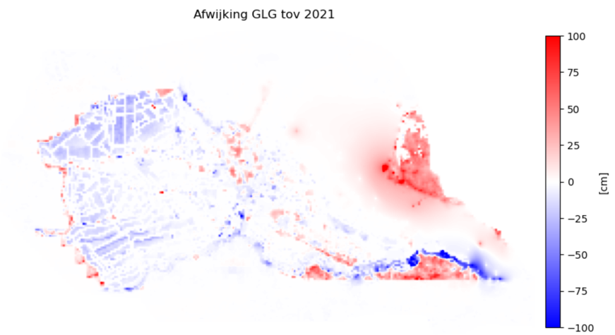
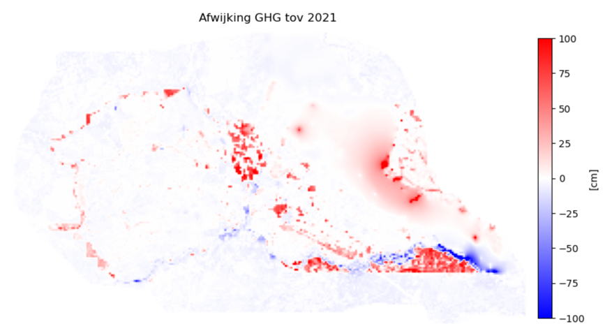
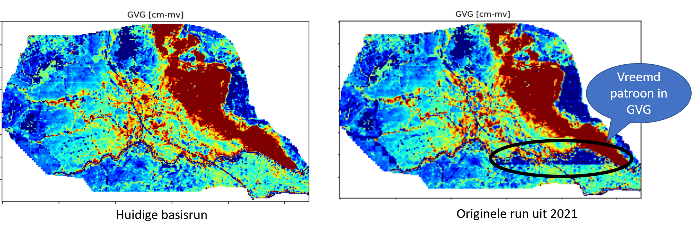
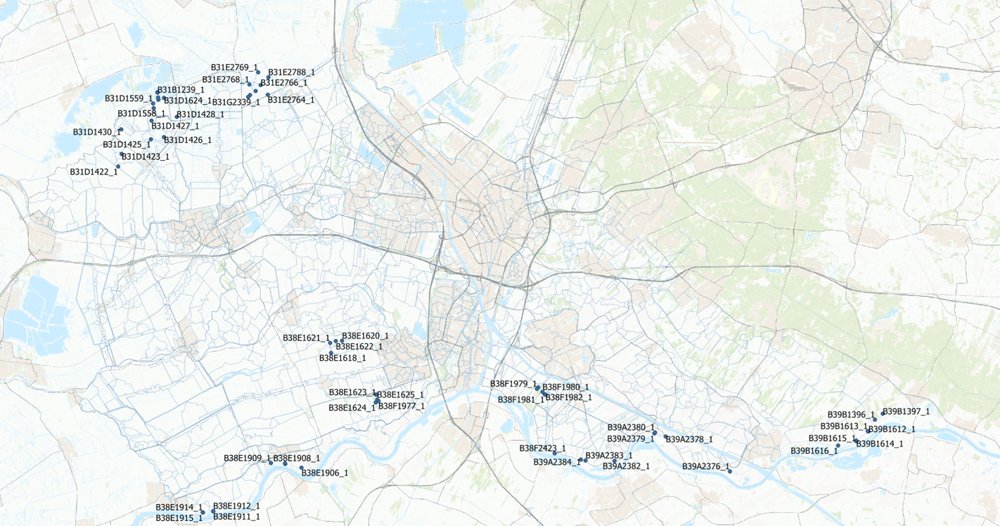
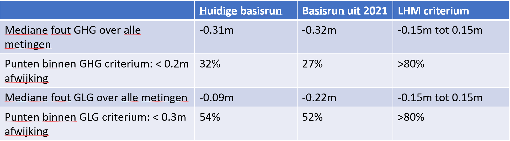
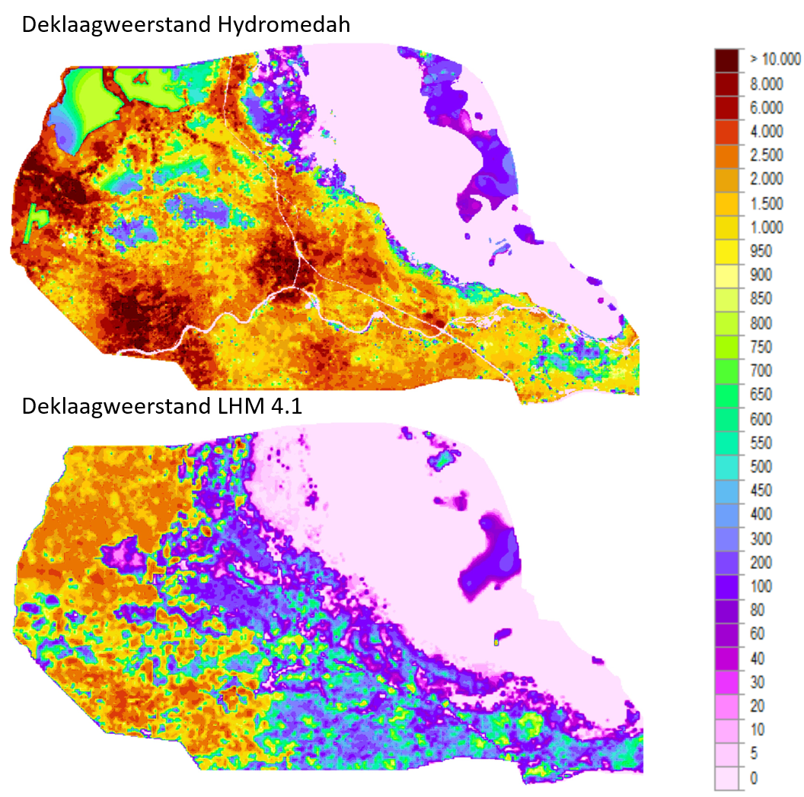
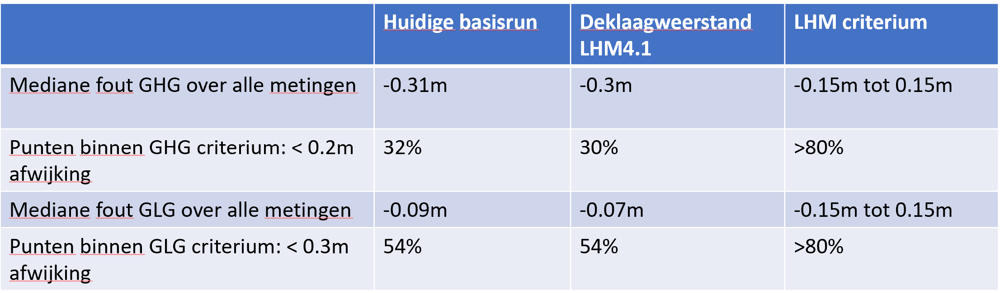
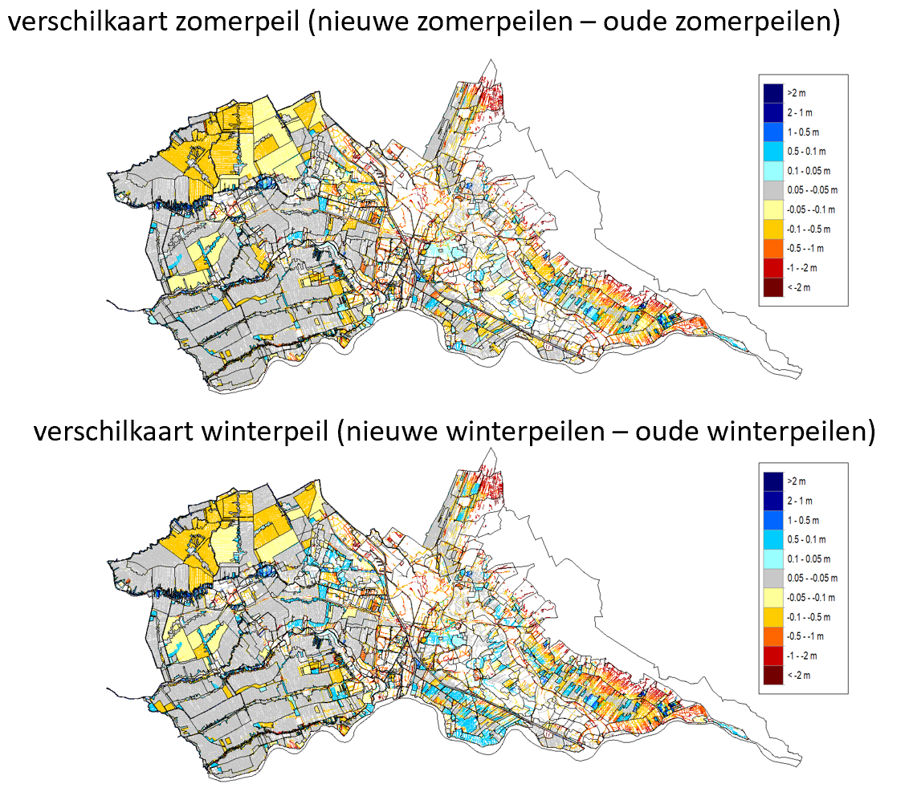
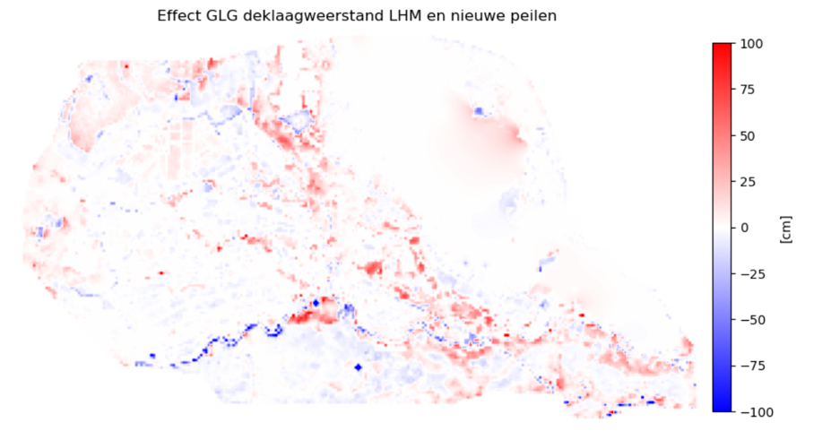

# Resultaten Hydromedah model

De resultaten zijn gepresenteerd aan de hand van de volgende paragrafen:  
1 Reproductie originele run  
2 Effect aanpassing deklaagweerstand  
3 Effect aanpassing peilen  
4 Effect aanpassing peilen en deklaagweerstand  
5 Conclusies en aanbevelingen  
  
##1 Reproductie originele run  
### 1.1 Vragen
In december 2021 is met hdsrhipy een originele run gedraaid met Hydromedah. Hiervan zijn de resultaten opgenomen in de rapportage.  
Wij proberen deze originele run te reproduceren en stellen de volgende vragen:  
  
1. Is de reproductie identiek aan de resultaten van 2021? Nee, dan gaan we naar vragen 2 en 3  
2. Zijn de verschillen te verklaren?  
3.  Levert de reproductie betere resultaten?   
###    
      
  
####Vraag 1 Is de reproductie identiek aan de resultaten van de 2021?
De resultaten van de originele run verschillen met de originele run uit 2021:   
-  Blauw: Grondwaterstand is hoger dan in 2021  
-  Rood:  Grondwaterstand is lager dan in 2021  

####Vraag 2 Zijn de verschillen te verklaren? 
We weten vooralsnog niet waardoor deze verschillen ontstaan. We hebben de volgende vragen beantwoord om een verklaring te vinden:

-  Is er een ander Hydromedah model gebruikt? Nee, de modellen zijn identiek  
-  Is er andere forcering gebruikt? De forcering(neerslag en verdamping is in 2021 niet opgeslagen, omdat de bestanden te groot waren. We kunnen
dus niet met zekerheid zeggen dat de forcering gelijk is.  
-  Zijn er andere software/processing scripts  gebruikt (hdsrhipy)? Het model wordt met dezelfde imodflow versie gedraaid.
Wel is het Python environment van de originele run niet opgeslagen. Dit wordt gebruikt voor de pre en postprocessing van het model. 

####Vraag 3  Levert de reproductie betere resultaten?
Kwalitatief: De nieuwe resultaten zien er plausibeler uit dan de resultaten van 2021: Vreemd patroon in GXG kaarten, zie onderstaande GVG

Kwantitatief: De resultaten zien er 
Op basis van code uit de validatie van het LHM: =>127 metingen die geschikt zijn voor validatie

Kwantitatief scoort de huidige runbeter op de LHM toetsingscriteria (HKV, 2021), maar beide runs scoren een onvoldoende.

Kwantitatief: De vraag is of toetsing aan LHM criteria, in dit geval, zinnig is: 
 
-  Aantal validatie metingen beperkt (127) en liggen veelal in clusters; de punten zijn misschien niet zo representatief voor het hele gebied      
-  Ruimtelijk beeld van de afwijking tussen beide modellen op validatiemeetpunten is gelijk bij GXG’s; verschillen tussen de resultaten zijn klein; zie onderstaande figuren.  
-  In Python notebook kun je de punten aanklikken en de exacte afwijking per punt zien.  

##2 Aanpassing deklaagweerstand
De deklaagweerstand van LHM is in het algemeen veel lager dan de deklaagweerstand van Hydromedaha, zie de onderstaande figuren.
Het effect op de GLG en GHG door lagere LHM deklaagweerstand is:  
  
- In infiltratiegebieden zakt de grondwaterstand (rode gebieden in figuren op volgende pagina)
- In drainagebieden stijgt de grondwaterstand (blauwe gebieden in figuren op volgende pagina)
- In de GLG zie je in drainagegebieden meer effect dan in de GHG. De grondwaterstand bij GHG is zo hoog, dat deze wordt afgetopt door de opgelegde drainagehoogte.

De aanpassing van de deklaagweerstand heeft een nihil effect op de statistiek van de LHM criteria. 

##3 Aanpassing peilenkaart
In het Python notebook vind je de stappen hoe de nieuwe peilen verwerkt zijn in het Hydromedah model
- Winter en zomerpeil zijn in de nieuwe peilenkaart in veel gebieden lager. Dit is terug te zien in de GLG en GHG
- Het effect van de aanpassing van de deklaagweerstand is groter dan de aanpassingen in de peilen
- We gaan ervan uit dat deze nieuwe peilen niet representatief zijn voor de periode 2010-2020. Een vergelijking met metingen heeft daarmee geen zin

In onderstaande figuen zie je verschilkaarten tussen respectievelijk het nieuwe winterpeil minus het Hydromedah winterpeil en het nieuwe zomerpeil minus het Hydromedah zomerpeil. Uit deze figuren blijkt dat de peilen over het algemeen verlaagd zijn. 
 

##4 Gecombineerd resultaat
Het effect op GLG en GHG door de aanpassing van de peilen en de deklaagweerstand wordt gepresenteerd in onderstaande figuur. Hierna tonen we de grondwatertrappenkaarten voor het huidig modelresultaat en het gecombineerde modelresultaat (aangepaste peilen en deklaagweerstand LHM):

##5 Conclusies en aanbevelingen
###5.1 Conclusies
-  De originele run die gedraaid is in 2021 verschilt van de huidige originele run. We weten vooralsnog niet waarom er een verschil is tussen beiden resultaten.
-  Zowel de huidige originele run als de huidige basisrun met LHM deklaagweerstand als de originelerun in 2021 produceren resultaten die ruim slechter zijn dan de toetscriteria die opgesteld zijn voor het LHM. Kanttekening hierbij:   
   1) Er zijn slechts 127 metingen die geschikt zijn om te valideren.   
   2) De metingen liggen veelal in clusters in het HDSR gebied.   
-  De deklaagweerstand van het LHM is in grote gebieden van het HDSR gebied vele malen kleiner dan de Hydromedah deklaagweerstand. Dit resulteert in een hogere grondwaterstand in de drainerende gebieden en een lagere grondwaterstand in de infiltratiegebieden
-  Het peil van de waterlopen is aangepast mbv de nieuwe peilenkaart. In grote gebieden gaan de peilen omlaag wat ook te zien is in de GLG en GHG

###5.2 Aanbevelingen
-  De originele run uit 2021 was niet te reproduceren. Dit kan in de toekomst alleen voorkomen worden door voldoende beheer en onderhoud op hdsrhipy, het model, de randvoorwaarden en de rekensoftware.
-  Het model voldoet niet aan de toetscriteria van het LHM tav GHG en GLG. De vraag is hoeveel effect deze fout heeft op het TEO debiet. Dit kan, buiten de scope van deze opdracht, verder onderzocht worden door het vergelijken van gemeten en gesimuleerde afvoeren en afvoerstatistiek.
-  Het basismodel was, voor zover wij kunnen overzien, niet eerder getoetst aan objectieve criteria. Wij bevelen aan zulke criteria op te stellen en te gebruiken voor toekomstige modelstudies.

##Literatuur:  
HKV, Acacia water en Berendrecht consultancy (2021), “Validatie en toetsing LHM 4.1”, HKV rapport 4313.10, https://puc.overheid.nl/rijkswaterstaat/doc/PUC_640427_31/1/   

